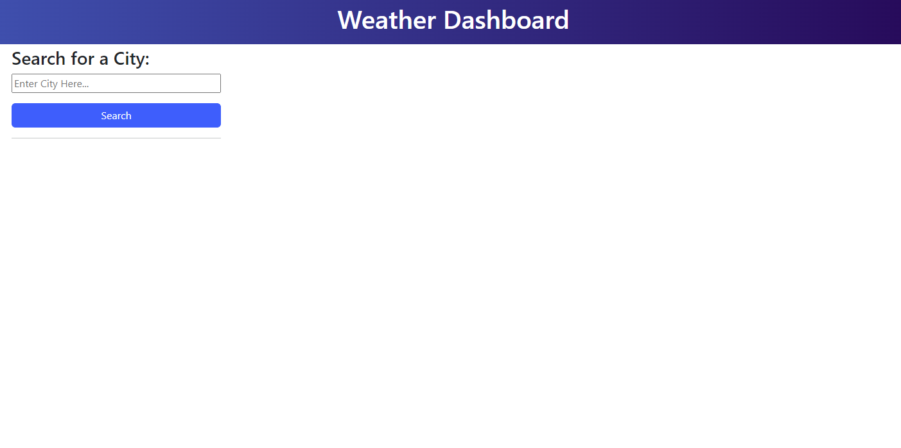
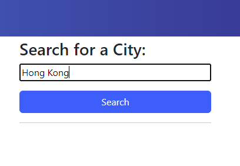
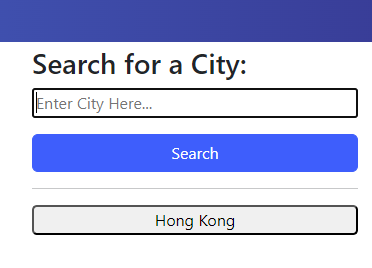
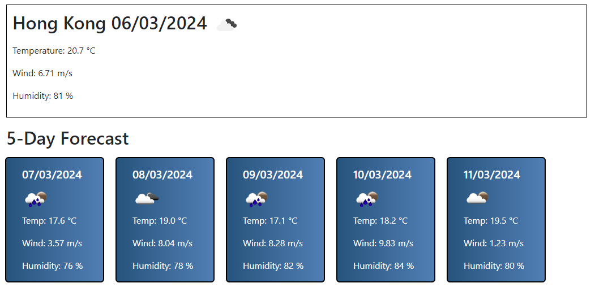

# 5-Day Weather Forecast Application

## Links

- [Deployed site](https://aaron1490.github.io/5-day-weather-forecast-application/)
- [GitHub Repository](https://github.com/aaron1490/5-day-weather-forecast-application)

## Table of Contents

- [User Story](#user-story)
- [Overview](#overview)
- [Features](#features)
- [Technologies Used](#technologies-used)
- [API Used](#api-used)
- [Demo/Usage](#demo-usage)

## User Story

```text
AS A traveler
I WANT to see the weather outlook for multiple cities
SO THAT I can plan a trip accordingly
```

## Overview

Weather Dashboard is a web application that allows users to check the current weather and a 5-day forecast for a specific city. The application utilizes the OpenWeatherMap API to retrieve weather data.

## Features

- Display current weather information including temperature, wind speed, and humidity.
- Show a 5-day forecast with temperature, weather icon, wind speed, and humidity.
- Save and display search history for quick access to previous searches.

## Technologies Used

- HTML
- CSS
- JavaScript (jQuery)
- [Bootstrap](https://getbootstrap.com/)
- [Day.js](https://day.js.org/)

## API Used

- [OpenWeatherMap API](https://openweathermap.org/)


## Demo/Usage

Open the application at the [deployed site](https://aaron1490.github.io/5-day-weather-forecast-application/)

Upon opening the page, this is what the user will see:



to use the applicationm please type a city into the search bar on the left



As you can see, previous searches are shown on the left below the search bar



See below image for how the 5-day forecast looks

